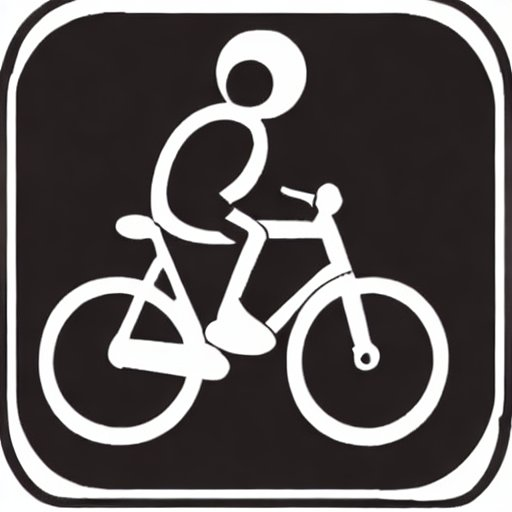
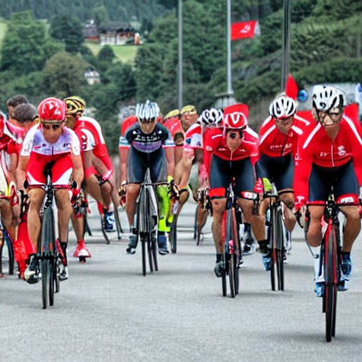
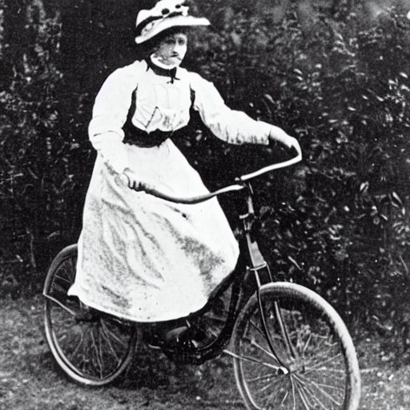
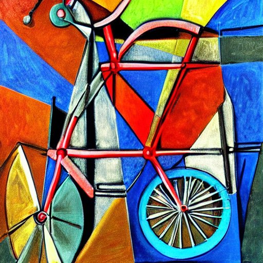
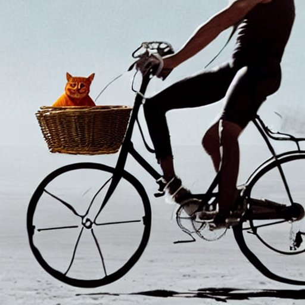

AI has the capability producing new and original images through prompts. This technology uses algorithms that allow it to learn certain patterns through analyzing existing images to create an output that reflects the prompt. These images can be as simple or complex as the user desires.

Below are some examples of AI generated art (created by Stable Diffussion) and their prompts:

<figure>
  
  <figcaption>_"Person on Bicycle Logo"_</figcaption>
</figure>

<figure>
  
  <figcaption>"Athlete Wearing Red Wins Cycling Race in Switzerland"</figcaption>
</figure>

<figure>
  
  <figcaption>"Woman in 1901 Riding a Bicycle"</figcaption>
</figure>

<figure>
  
  <figcaption>"Bicycle in Picasso's Style"</figcaption>
</figure>

<figure>
  
  <figcaption>"Human Cyclist with an Orange Cat in a Basket Riding on the Moon"</figcaption>
</figure>

