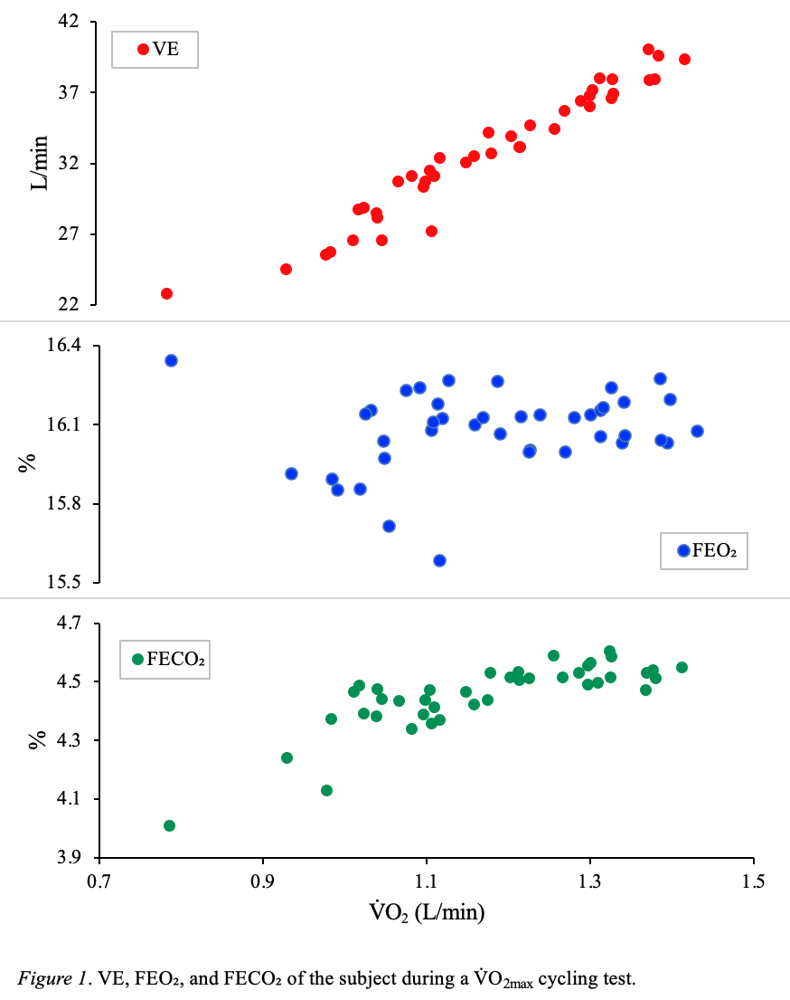

Maximal oxygen uptake (V&#x0307;O2max) is the peak rate of oxygen consumed during exercise. A greater V&#x0307;O2max level means that the body is more efficient at delivering oxygen and can change based on the type and intensity of training. Direct and indirect tests can be used to measure this value. 

Characteristically, a V&#x0307;O2max test graph has two breaks. These represent thresholds which divide different test stages. The first break is the ventilatory threshold (VT), where ventilation (VE) begins to increase disproportionately to oxygen uptake. This marks the point where the body starts to use anaerobic sources because the demand exceeds the aerobic system's capacity.

The second break is the respiratory compensation point (RCP), where ventilation can no longer keep up with the body's demand for oxygen, resulting in a CO2 increase. V&#x0307;O2max typically occurs just before the RCP.

Below are the results of a direct V&#x0307;O2maxtest done by a 20-year-old female using a cycle ergometer (created through Excel):

{: .mx-auto.d-block :}

The top graph (in red) depicts ventilation (VE) plotted against V&#x0307;O2. 

The second graph (in blue) depicts the fraction of oxygen in the expired air (VEO2) plotted against V&#x0307;O2. 

The second graph (in green) depicts the fraction of carbon dioxide in the expired air (VECO2) plotted against V&#x0307;O2.

More information on the data can be found [here](cycle_subject.xlsx).

**References:**  
Iannetta, D., de Almeida Azevedo, R., Keir, D. A., &amp; Murias, J. M. (2019). Establishing the V&#x0307;O2 versus constant-work-rate relationship from ramp-incremental exercise: Simple strategies for an unsolved problem. _Journal of Applied Physiology_, _127_(6), 1519–1527. https://doi.org/10.1152/japplphysiol.00508.2019  
Keteyian, S. J., Brawner, C. A., Savage, P. D., Ehrman, J. K., Schairer, J., Divine, G., Aldred, H., Ophaug, K., & Ades, P. A. (2008). Peak aerobic capacity predicts prognosis in patients with coronary heart disease. _American Heart Journal_, _156_(2), 292–300. https://doi.org/10.1016/j.ahj.2008.03.017
