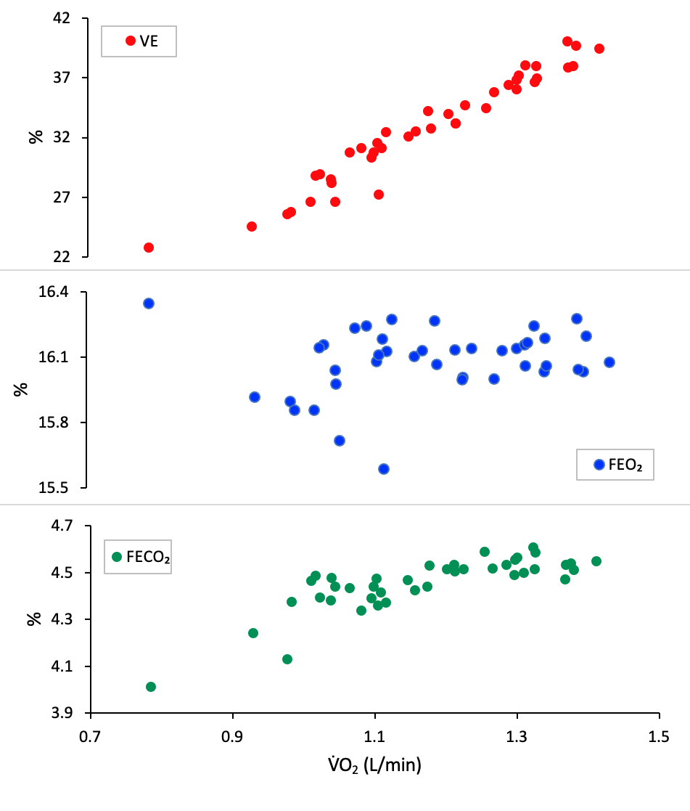

Maximal oxygen uptake (V&#x0307;O2 max) is the peak rate of oxygen consumed during exercise. A greater V&#x0307;O2 max level means that the body is more efficient at delivering oxygen and can change based on the type and intensity of training. Direct and indirect tests can be used to measure this value. 

Characteristically, a V&#x0307;O2 max test has two breaks. These represent thresholds which divide different test stages. The first break is the ventilatory threshold (VT), where ventilation (VE) increases exponentially to oxygen uptake. This marks the point where the body starts to use anaerobic sources because the demand exceeds the aerobic system's capacity.

The second break is the respiratory compensation point (RCP), where ventilation can no longer keep up with the body's demand for oxygen, resulting in a CO2 increase. The V&#x0307;O2 max point typically occurs just before the RCP.

Below are the results of a direct test done by a 20-year-old female using a cycle ergometer:

{: .mx-auto.d-block :}

The top graph (in red) depicts ventilation (VE) plotted against V&#x0307;O2. 

The second graph (in blue) depicts the fraction of oxygen in the expired air (VEOO2) plotted against V&#x0307;O2. 

The second graph (in green) depicts the fraction of carbon dioxide in the expired air (VECOO2) plotted against V&#x0307;O2.

More information on the data can be found here.
