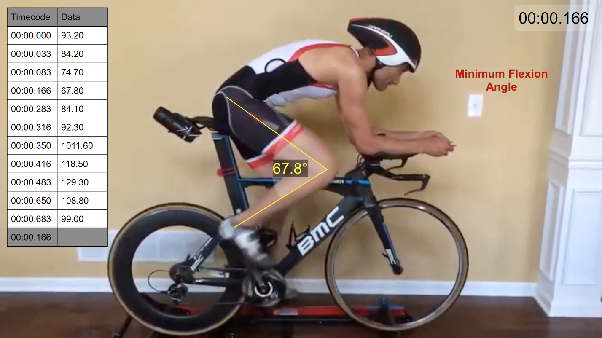
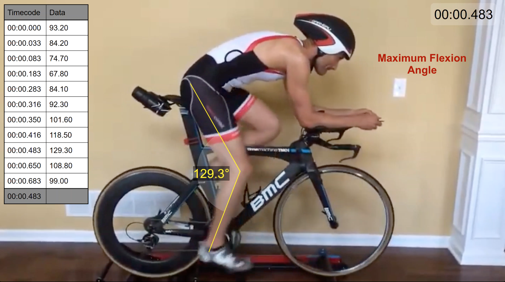

Motion analysis uses technology, computer applications and data analysis to evaluate movement. Although it can take many forms, such as using complex cameras and sensors, it can be done more through more accessible methods, such as annotating pre-existing videos using applications such as Dartfish. 

An advantage of this technology is that it can quantify motion quite accurately. This can help researchers, coaches, healthcare professionals, athletes and others better understand movement aspects, such as patterns, techniques, tendencies and various biomechanical factors. This can be beneficial to help improve movement and optimize performance in a variety of populations. 

Below is a video analyzing an athlete's knee flexion angles while cycling (created through Dartfish). The data table contains various angles collected at several points during one revolution to demonstrate his movement pattern. 

{: .mx-auto.d-block :}
(Note: The video may take a minute to load or require a page refresh. Still having trouble viewing? Click [here](images/video.mp4))

Data from this motion analysis could be used to compare the athlete's performance to others or to see fluctuations in his cycling patterns (eg. comparing angles in various revolutions). Such videos can also be paused to capture more key moments, such as those below:

{: .mx-auto.d-block :}

This is the postition where the angle between the upper and lower leg is the smallest (mimimum flexion angle). For this athlete, it is 67.8°. 

{: .mx-auto.d-block :}

This is the postition where the angle between the upper and lower leg is the largest (maximum flexion angle). For this athlete, it is 129.3°.

**References:**  
Owens, J. G., Rauzi, M. R., Kittelson, A., Graber, J., Bade, M. J., Johnson, J., & Nabhan, D. (2020). How New Technology is Improving Physical Therapy. _Current Reviews in Musculoskeletal Medicine_, _13_(2), 200–211. https://doi.org/10.1007/s12178-020-09610-6 
