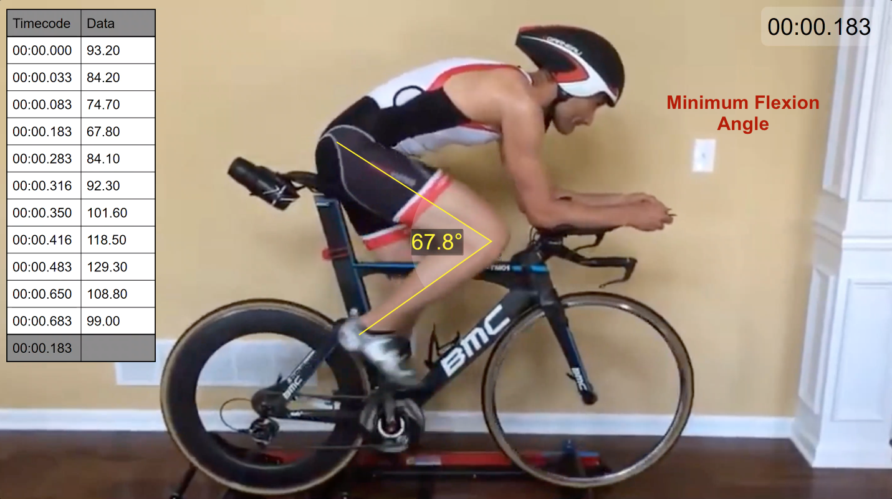

Below is a video analyzing an athlete's knee flexion angles while cycling. The data table contains various angles during one revolution. 

{: .mx-auto.d-block :}

{: .mx-auto.d-block :}

{: .mx-auto.d-block :}
